<h1 name="content" align="center"><a href=""></a> MSSQL</h1>

<p align="center">
  <a href="#lab1"></a> 
  <a href="#lab2"></a> 
  <a href="#lab3"></a> 
  <a href="#lab4"></a> 
  <a href="#lab5"></a> 
  <a href="#lab6"></a> 
  <a href="#lab7"></a> 
  <a href="#lab7"></a> 
</p>

# Лабараторная №1
[Назад](#content)
<h3 align="center">
  <a href="#client"></a>
  Автоматизация распределения учебной нагрузки. Вариант 18.
</h3>

Разработать ER-модель данной предметной области: выделить сущности, их атрибуты, связи между сущностями. 
Для каждой сущности указать ее имя, атрибут (или набор атрибутов), являющийся первичным ключом, список остальных атрибутов.
Для каждого атрибута указать его тип, ограничения, может ли он быть пустым, является ли он первичным ключом.
Для каждой связи между сущностями указать: 
- тип связи (1:1, 1:M, M:N)
- обязательность
ER-модель д.б. представлена в виде ER-диаграммы (картинка)
По имеющейся ER-модели создать реляционную модель данных и отобразить ее в виде списка сущностей с их атрибутами и типами атрибутов,  для атрибутов указать, явл. ли он первичным или внешним ключом

Информация о преподавателях: ФИО, список дисциплин, которые он может вести, обязательное кол-во часов нагрузки (отдельно лекции и практика).
Учебный план (составляется на текущий учебный год): дисциплина, специальность, курс, семестр, кол-во часов (отдельно лекции и практика), вид отчетности (зачет, экзамен), преподаватель.
Реализовать:
- Вывод нагрузки конкретного преподавателя;
- Вывод учебной нагрузки для специальности (дисциплина, кол-во часов, вид (лекция /практика), преподаватель).
- Подчсет кол-ва часов нагрузки преподавателя, поиск самого «загруженного преподавателя»
- Вывод списка экзаменов и зачетов в ближайшую сессию для специальности на конкретном курсе

#### ER модель:


#### Реляционная модель:


<a id="lab2"></a>
# Лабараторная №2
[Назад](#content)


В соответствии с реляционной моделью данных, разработанной в Лаб.№1, создать реляционную БД на учебном сервере БД :
- создать таблицы, определить первичные ключи и иные ограничения
- определить связи между таблицами
- создать диаграмму
- заполнить все таблицы адекватной информацией (не меньше 10 записей в таблицах, наличие примеров для связей типа 1:M )


```
CREATE TABLE Дисциплина (
    ID INT PRIMARY KEY IDENTITY,
    Название NVARCHAR(50) NOT NULL
);

CREATE TABLE Специальность (
    ID INT PRIMARY KEY IDENTITY,
    Название NVARCHAR(50) NOT NULL
);

CREATE TABLE Тип_занятия (
    ID INT PRIMARY KEY IDENTITY,
    Название NVARCHAR(8) NOT NULL CHECK (Название IN ('Лекция','Практика'))
);

CREATE TABLE Тип_отчётности (
    ID INT PRIMARY KEY IDENTITY,
    Название NVARCHAR(7) NOT NULL CHECK (Название IN ('Зачёт','Экзамен'))
);

CREATE TABLE Преподаватель (
    ID INT PRIMARY KEY IDENTITY,
    ФИО NVARCHAR(150) NOT NULL,
    [Обязательные часы(лекции)] TINYINT NOT NULL,
    [Обязательные часы(практика)] TINYINT NOT NULL
);

CREATE TABLE Учебный_план (
    ID INT PRIMARY KEY IDENTITY,
    Курс TINYINT NOT NULL,
    Семестр TINYINT NOT NULL CHECK (Семестр IN (1,2)),
    [Учебный год] NVARCHAR(9) NOT NULL,
    [Часы лекций] TINYINT NOT NULL,
    [Часы практик] TINYINT NOT NULL,
    Специальность_ID INT NOT NULL FOREIGN KEY REFERENCES Специальность(ID),
    Дисциплина_ID INT NOT NULL FOREIGN KEY REFERENCES Дисциплина(ID),
    Тип_отчётности_ID INT NOT NULL FOREIGN KEY REFERENCES Тип_отчётности(ID)
);

CREATE TABLE Нагрузка (
    ID INT PRIMARY KEY IDENTITY,
    [Назначенные часы] TINYINT NOT NULL,
    Учебный_план_ID INT NOT NULL FOREIGN KEY REFERENCES Учебный_план(ID),
    Преподаватель_ID INT NOT NULL FOREIGN KEY REFERENCES Преподаватель(ID),
    Тип_занятия_ID INT NOT NULL FOREIGN KEY REFERENCES Тип_занятия(ID)
);

CREATE TABLE Дисциплина_Специальность (
    Дисциплина_ID INT NOT NULL FOREIGN KEY REFERENCES Дисциплина(ID),
    Специальность_ID INT NOT NULL FOREIGN KEY REFERENCES Специальность(ID),
    PRIMARY KEY (Дисциплина_ID, Специальность_ID)
);

CREATE TABLE Преподаватель_Дисциплина (
    Преподаватель_ID INT NOT NULL FOREIGN KEY REFERENCES Преподаватель(ID),
    Дисциплина_ID INT NOT NULL FOREIGN KEY REFERENCES Дисциплина(ID),
    PRIMARY KEY (Преподаватель_ID, Дисциплина_ID)
);
```

#### Диаграмма:


#### Заполнение таблиц:
```
INSERT INTO Дисциплина (Название) VALUES
('Математический анализ'),
('Теория вероятности'), 
('История'),
('Основы Российской государственности'),
('Языки машинного программирования'),
('Основы информатики'),
('Комплексный анализ'),
('Физкультура'),
('Дифференциальные уравнения'),
('Физика');
```

```
INSERT INTO Специальность (Название) VALUES
('Прикладная математика и информатика'),
('Математика и компьютерные науки'),
('Фундаментальная математика и механика'),
('Прикладная математика и физика'),
('Бизнес-информатика'),
('Программная инженерия'),
('Математическое обеспечение'),
('Информатика и вычислительная техника'),
('Статистика и анализ данных'),
('Информационная безопасность');
```

```
INSERT INTO Преподаватель (ФИО, [Обязательные часы(лекции)], [Обязательные часы(практика)]) VALUES
('Иванов Александр Сергеевич', 120, 80),
('Петрова Мария Владимировна', 100, 100),
('Сидоров Дмитрий Иванович', 150, 60),
('Козлова Елена Петровна', 80, 120),
('Никитин Алексей Викторович', 130, 70),
('Фёдорова Ольга Дмитриевна', 90, 110),
('Громов Павел Сергеевич', 140, 50),
('Смирнова Анна Михайловна', 110, 90),
('Васильев Игорь Николаевич', 95, 105),
('Зайцева Татьяна Викторовна', 125, 75);
```

```
INSERT INTO Преподаватель_Дисциплина (Преподаватель_ID, Дисциплина_ID) VALUES
(1,1), (1,2), (1,7), (1,9),  
(2,5), (2,6), (2,8),
(3,10), (3,1),
(4,3), (4,4), 
(5,2), (5,9), (5,10),
(6,5), (6,6), (6,8),
(7,1), (7,7), (7,9),
(8,3), (8,4), (8,8),
(9,5), (9,6), (9,10),
(10,2), (10,7), (10,9);
```

```
INSERT INTO Дисциплина_Специальность (Дисциплина_ID, Специальность_ID) VALUES
(1,1), (2,1), (5,1), (6,1), (7,1), (9,1), (10,1), 
(1,2), (2,2), (5,2), (6,2), (7,2), (9,2),
(1,3), (2,3), (7,3), (9,3), (10,3),
(1,4), (2,4), (7,4), (9,4), (10,4),
(2,5), (5,5), (6,5), (8,5),
(1,6), (2,6), (5,6), (6,6), (9,6),
(1,7), (2,7), (5,7), (6,7), (9,7),
(1,8), (2,8), (5,8), (6,8), (10,8),
(1,9), (2,9), (5,9), (6,9),
(1,10), (2,10), (5,10), (6,10), (9,10),
(3,1), (3,2), (3,3), (3,4), (3,5), (3,6), (3,7), (3,8), (3,9), (3,10),
(4,1), (4,2), (4,3), (4,4), (4,5), (4,6), (4,7), (4,8), (4,9), (4,10),
(8,1), (8,2), (8,3), (8,4), (8,6), (8,7), (8,8), (8,9), (8,10);
```

```
INSERT INTO Учебный_план (Курс, Семестр, [Учебный год], [Часы лекций], [Часы практик], Специальность_ID, Дисциплина_ID, Тип_отчётности_ID) VALUES
(1, 1, '2023-2024', 60, 40, 1, 1, 2), 
(1, 1, '2023-2024', 50, 30, 1, 6, 2),
(1, 2, '2023-2024', 70, 35, 1, 2, 2),
(1, 1, '2023-2024', 40, 20, 2, 1, 2),
(1, 2, '2023-2024', 55, 25, 2, 5, 2),
(1, 1, '2023-2024', 65, 30, 3, 1, 2),
(1, 2, '2023-2024', 60, 30, 3, 10, 2),
(1, 1, '2023-2024', 45, 15, 4, 3, 1),
(1, 1, '2023-2024', 30, 30, 4, 8, 1), 
(1, 2, '2023-2024', 35, 15, 5, 4, 1);

INSERT INTO Тип_отчётности (Название) VALUES ('Зачёт'), ('Экзамен');
```

```
INSERT INTO Нагрузка ([Назначенные часы], Учебный_план_ID, Преподаватель_ID, Тип_занятия_ID) VALUES
(60, 1, 1, 1), (40, 1, 1, 2),
(50, 2, 2, 1), (30, 2, 2, 2),
(70, 3, 3, 1), (35, 3, 3, 2),
(55, 5, 5, 1), (25, 5, 5, 2),
(60, 7, 7, 1), (30, 7, 7, 2),
(45, 8, 4, 1), (15, 8, 4, 2),
(30, 9, 6, 1), (30, 9, 6, 2),
(35, 10, 8, 1), (15, 10, 8, 2);

INSERT INTO Тип_занятия (Название) VALUES ('Лекция'), ('Практика');
```


<a id="lab3"></a>
# Лабараторная №3
[Назад](#content)
> Цель: изучить конструкции языка SQL для манипулирования данными в СУБД  MSSQL.

📄 [Часть 1](./lab_3/3%20лаба%201%20часть.docx)
 
📄 [Часть 2](./lab_3/3%20лаба%202%20часть.docx)


<a id="lab4"></a>
# Лабараторная №4
[Назад](#content)


<a id="lab6"></a>
# Лабараторная №6
[Назад](#content)


```

CREATE TABLE Graph_teacher (
    id INT PRIMARY KEY,
    ФИО NVARCHAR(150) NOT NULL,
    Обязательные_часы_лекции TINYINT NOT NULL,
    Обязательные_часы_практика TINYINT NOT NULL
) AS NODE;

CREATE TABLE Graph_discipline (
    id INT PRIMARY KEY,
    Название NVARCHAR(50) NOT NULL
) AS NODE;

CREATE TABLE Graph_specialization (
    id INT PRIMARY KEY,
    Название NVARCHAR(50) NOT NULL
) AS NODE;

CREATE TABLE Graph_load (
    id INT PRIMARY KEY,
    Назначенные_часы TINYINT NOT NULL
) AS NODE;

CREATE TABLE Graph_lesson_type (
    id INT PRIMARY KEY,
    Название NVARCHAR(8) NOT NULL CHECK (Название IN ('Лекция','Практика'))
) AS NODE;

CREATE TABLE Graph_study_plan (
    id INT PRIMARY KEY,
    Курс TINYINT NOT NULL,
    Семестр TINYINT NOT NULL CHECK (Семестр IN (1,2)),
    Учебный_год NVARCHAR(9) NOT NULL,
    Часы_лекций TINYINT NOT NULL,
    Часы_практик TINYINT NOT NULL
) AS NODE;

CREATE TABLE Graph_assessment_type (
    id INT PRIMARY KEY,
    Название NVARCHAR(7) NOT NULL CHECK (Название IN ('Зачёт','Экзамен'))
) AS NODE;


CREATE TABLE CAN_TEACH AS EDGE;
CREATE TABLE RELATED_TO_SPECIALTY AS EDGE;
CREATE TABLE ASSIGNED_TO_TEACHER AS EDGE;
CREATE TABLE CONTAINS_DISCIPLINE AS EDGE;
CREATE TABLE INCLUDES_SPECIALTY AS EDGE;
CREATE TABLE HAS_LESSON_TYPE AS EDGE;
CREATE TABLE HAS_ASSESSMENT_TYPE AS EDGE;
CREATE TABLE BELONGS_TO_STUDY_PLAN AS EDGE;


INSERT INTO Graph_teacher (id, ФИО, Обязательные_часы_лекции, Обязательные_часы_практика)
SELECT ID, ФИО, [Обязательные часы(лекции)], [Обязательные часы(практика)]
FROM Преподаватель;

INSERT INTO Graph_discipline (id, Название)
SELECT ID, Название
FROM Дисциплина;

INSERT INTO Graph_specialization (id, Название)
SELECT ID, Название
FROM Специальность;

INSERT INTO Graph_lesson_type (id, Название)
SELECT ID, Название
FROM Тип_занятия;

INSERT INTO Graph_assessment_type (id, Название)
SELECT ID, Название
FROM Тип_отчётности;

INSERT INTO Graph_study_plan (id, Курс, Семестр, Учебный_год, Часы_лекций, Часы_практик)
SELECT ID, Курс, Семестр, [Учебный год], [Часы лекций], [Часы практик]
FROM Учебный_план;

INSERT INTO Graph_load (id, Назначенные_часы)
SELECT ID, [Назначенные часы]
FROM Нагрузка;
GO


INSERT INTO CAN_TEACH ($from_id, $to_id)
SELECT t.$node_id, d.$node_id
FROM Graph_teacher t
JOIN Graph_discipline d ON EXISTS (
    SELECT 1 FROM Преподаватель_Дисциплина pd
    WHERE pd.Преподаватель_ID = t.id AND pd.Дисциплина_ID = d.id
);


INSERT INTO RELATED_TO_SPECIALTY ($from_id, $to_id)
SELECT d.$node_id, s.$node_id
FROM Graph_discipline d
JOIN Graph_specialization s ON EXISTS (
    SELECT 1 FROM Дисциплина_Специальность ds
    WHERE ds.Дисциплина_ID = d.id AND ds.Специальность_ID = s.id
);


INSERT INTO ASSIGNED_TO_TEACHER ($from_id, $to_id)
SELECT l.$node_id, t.$node_id
FROM Graph_load l
JOIN Graph_teacher t ON EXISTS (
    SELECT 1 FROM Нагрузка n
    WHERE n.ID = l.id AND n.Преподаватель_ID = t.id
);


INSERT INTO CONTAINS_DISCIPLINE ($from_id, $to_id)
SELECT l.$node_id, d.$node_id
FROM Graph_load l
JOIN Graph_discipline d ON EXISTS (
    SELECT 1 FROM Нагрузка n
    JOIN Учебный_план up ON n.Учебный_план_ID = up.ID
    WHERE n.ID = l.id AND up.Дисциплина_ID = d.id
);


INSERT INTO INCLUDES_SPECIALTY ($from_id, $to_id)
SELECT sp.$node_id, s.$node_id
FROM Graph_study_plan sp
JOIN Graph_specialization s ON EXISTS (
    SELECT 1 FROM Учебный_план up
    WHERE up.ID = sp.id AND up.Специальность_ID = s.id
);


INSERT INTO HAS_LESSON_TYPE ($from_id, $to_id)
SELECT l.$node_id, lt.$node_id
FROM Graph_load l
JOIN Graph_lesson_type lt ON EXISTS (
    SELECT 1 FROM Нагрузка n
    WHERE n.ID = l.id AND n.Тип_занятия_ID = lt.id
);


INSERT INTO HAS_ASSESSMENT_TYPE ($from_id, $to_id)
SELECT sp.$node_id, at.$node_id
FROM Graph_study_plan sp
JOIN Graph_assessment_type at ON EXISTS (
    SELECT 1 FROM Учебный_план up
    WHERE up.ID = sp.id AND up.Тип_отчётности_ID = at.id
);


INSERT INTO BELONGS_TO_STUDY_PLAN ($from_id, $to_id)
SELECT l.$node_id, sp.$node_id
FROM Graph_load l
JOIN Graph_study_plan sp ON EXISTS (
    SELECT 1 FROM Нагрузка n
    WHERE n.ID = l.id AND n.Учебный_план_ID = sp.id
);
GO
```

```
-- Для каждой дисциплины вывести преподавателей, которые могут ее вести
SELECT
    d.Название AS Дисциплина,
    STRING_AGG(t.ФИО, ', ') AS Преподаватели
FROM 
    Graph_discipline d,
    Graph_teacher t,
    CAN_TEACH ct
WHERE MATCH(t-(ct)->d)
GROUP BY d.Название
ORDER BY d.Название
```


```
-- Найти преподавателей с максимальной нагрузкой по лекциям
SELECT TOP 1 WITH TIES
    t.ФИО,
    SUM(l.Назначенные_часы) AS Общее_число_часов_лекций
FROM 
    Graph_teacher t,
    Graph_load l,
    Graph_lesson_type lt,
    ASSIGNED_TO_TEACHER,
    HAS_LESSON_TYPE
WHERE MATCH(t<-(ASSIGNED_TO_TEACHER)-l-(HAS_LESSON_TYPE)->lt)
    AND lt.Название = 'Лекция'
GROUP BY t.ФИО
ORDER BY SUM(l.Назначенные_часы) DESC
```


```
-- Для каждой дисциплины и каждой специальности вывести количество лет
SELECT
    s.Название AS Специальность,
    d.Название AS Дисциплина,
    COUNT(DISTINCT sp.Учебный_год) * 0.5 AS Продолжительность_в_годах
FROM 
    Graph_discipline d,
    Graph_specialization s,
    Graph_study_plan sp,
    RELATED_TO_SPECIALTY,
    INCLUDES_SPECIALTY
WHERE MATCH(d-(RELATED_TO_SPECIALTY)->s<-(INCLUDES_SPECIALTY)-sp)
GROUP BY s.Название, d.Название
ORDER BY s.Название, d.Название
```


```
-- Найти дисциплины, по которым есть лекции, но нет практики
SELECT DISTINCT
    s.Название AS Специальность,
    sp.Курс,
    d.Название AS Дисциплина
FROM 
    Graph_discipline d,
    Graph_specialization s,
    Graph_study_plan sp,
    RELATED_TO_SPECIALTY,
    INCLUDES_SPECIALTY
WHERE MATCH(d-(RELATED_TO_SPECIALTY)->s<-(INCLUDES_SPECIALTY)-sp)
    AND sp.Часы_лекций > 0 
    AND sp.Часы_практик = 0
ORDER BY s.Название, sp.Курс, d.Название
```


```
--  Для каждого преподавателя выдать дисциплины (лекции и практику отдельно)
SELECT
    t.ФИО,
    ISNULL(STRING_AGG(CASE WHEN sp.Часы_лекций > 0 THEN d.Название END, ', '), '') AS Лекции,
    ISNULL(STRING_AGG(CASE WHEN sp.Часы_практик > 0 THEN d.Название END, ', '), '') AS Практика
FROM 
    Graph_teacher t,
    Graph_discipline d,
    Graph_specialization s,
    Graph_study_plan sp,
    CAN_TEACH,
    RELATED_TO_SPECIALTY,
    INCLUDES_SPECIALTY
WHERE MATCH(t-(CAN_TEACH)->d-(RELATED_TO_SPECIALTY)->s<-(INCLUDES_SPECIALTY)-sp)
GROUP BY t.ФИО
ORDER BY t.ФИО
```


<a id="lab7"></a>
# Лабараторная №7
[Назад](#content)

Задание 1
Используя базу, полученную в лабораторной 2, создать транзакцию, произвести ее откат и фиксацию. Показать, что данные существовали до отката, удалились после отката, снова были добавлены, и затем были успешно зафиксированы. При необходимости используйте точки сохранения и вложенные транзакции.
```

SELECT 
    * 
FROM 
    Нагрузка n
    JOIN Преподаватель p ON n.Преподаватель_ID = p.ID
WHERE 
    p.ФИО = 'Смирнова Анна Михайловна'


-- Начало транзакции
BEGIN TRANSACTION;

DECLARE @PrepID INT = (SELECT ID FROM Преподаватель WHERE ФИО = 'Смирнова Анна Михайловна');
DECLARE @PlanID INT = 1;

---- Добавляем нагрузку (лекции) - 120 часов (превышает лимит 110)
--INSERT INTO Нагрузка ([Назначенные часы], Учебный_план_ID, Преподаватель_ID, Тип_занятия_ID)
--VALUES (120, @PlanID, @PrepID, 1);

-- Добавляем нагрузку (лекции) - 20 часов
INSERT INTO Нагрузка ([Назначенные часы], Учебный_план_ID, Преподаватель_ID, Тип_занятия_ID)
VALUES (20, @PlanID, @PrepID, 1);

DECLARE @LoadID INT = SCOPE_IDENTITY();

SELECT * FROM Нагрузка WHERE ID = @LoadID;

-- Сумму лекций
DECLARE @TotalLectures INT;
SELECT 
    @TotalLectures = SUM([Назначенные часы]) 
FROM 
    Нагрузка 
WHERE 
    Преподаватель_ID = @PrepID AND Тип_занятия_ID = 1;

DECLARE @RequiredLectures TINYINT = (SELECT [Обязательные часы(лекции)] FROM Преподаватель WHERE ID = @PrepID);

IF @TotalLectures > @RequiredLectures
BEGIN
    PRINT 'Превышение обязательных часов! Выполняется откат.';
    ROLLBACK TRANSACTION ;    
END
ELSE
BEGIN
    COMMIT TRANSACTION;
END


SELECT 
    * 
FROM 
    Нагрузка n
    JOIN Преподаватель p ON n.Преподаватель_ID = p.ID
WHERE 
    p.ФИО = 'Смирнова Анна Михайловна'

```


Задание 2
Подготовить SQL-скрипты для выполнения проверок изолированности транзакций. Ваши скрипты должны работать с одной из таблиц, созданных в лабораторной работе №2.

READ UNCOMMITTED
грязного чтения
```
SET TRANSACTION ISOLATION LEVEL READ UNCOMMITTED;

BEGIN TRANSACTION;

UPDATE Преподаватель
SET [Обязательные часы(лекции)] = 1
WHERE ФИО = 'Смирнова Анна Михайловна';

-- Показываем незафиксированные данные внутри транзакции
SELECT 'Сеанс 1: Грязные данные внутри транзакции' AS Ситуация,
       ID, 
       ФИО, 
       [Обязательные часы(лекции)] AS Обязательные_часы_лекции
FROM Преподаватель
WHERE ФИО = 'Смирнова Анна Михайловна';

WAITFOR DELAY '00:00:10';

ROLLBACK TRANSACTION;

SELECT 'Сеанс 1: После отката (данные восстановлены)' AS Ситуация,
       ID, 
       ФИО, 
       [Обязательные часы(лекции)] AS Обязательные_часы_лекции
FROM Преподаватель
WHERE ФИО = 'Смирнова Анна Михайловна';
```
```
SET TRANSACTION ISOLATION LEVEL READ UNCOMMITTED;

WAITFOR DELAY '00:00:03';

-- ГРЯЗНОЕ ЧТЕНИЕ
SELECT 'Сеанс 2: Грязное чтение (READ UNCOMMITTED)' AS Ситуация,
       ID, 
       ФИО, 
       [Обязательные часы(лекции)] AS Обязательные_часы_лекции
FROM Преподаватель
WHERE ФИО = 'Смирнова Анна Михайловна';
GO
```


В ходе выполнения сценариев при уровне изоляции READ UNCOMMITTED было установлено, что данный уровень допускает чтение данных, изменённых, но не зафиксированных другими транзакциями. В результате в эксперименте было зафиксировано грязное чтение — вторая транзакция успешно прочитала значения, которые впоследствии были отменены первой транзакцией с помощью операции ROLLBACK.
Вывод: Уровень изоляции READ UNCOMMITTED обеспечивает максимальную производительность, но полностью нарушает согласованность данных.
```

SET TRANSACTION ISOLATION LEVEL READ UNCOMMITTED;

BEGIN TRANSACTION;

SELECT 'Сеанс 1: Чтение текущего значения' AS Ситуация,
       ID, 
       ФИО, 
       [Обязательные часы(практика)] AS Обязательные_часы_практики
FROM Преподаватель
WHERE ФИО = 'Смирнова Анна Михайловна';

WAITFOR DELAY '00:00:05';

UPDATE Преподаватель
SET [Обязательные часы(практика)] = [Обязательные часы(практика)] + 10
WHERE ФИО = 'Смирнова Анна Михайловна';

COMMIT TRANSACTION;

SELECT 'Сеанс 1: Результат после COMMIT' AS Ситуация,
       ID, 
       ФИО, 
       [Обязательные часы(практика)] AS Обязательные_часы_практики
FROM Преподаватель
WHERE ФИО = 'Смирнова Анна Михайловна';
```
```
SET TRANSACTION ISOLATION LEVEL READ UNCOMMITTED;

WAITFOR DELAY '00:00:01';

BEGIN TRANSACTION;

SELECT 'Сеанс 2: Чтение значения (до обновления)' AS Ситуация,
       ID, 
       ФИО, 
       [Обязательные часы(практика)] AS Обязательные_часы_практики
FROM Преподаватель
WHERE ФИО = 'Смирнова Анна Михайловна';

UPDATE Преподаватель
SET [Обязательные часы(практика)] = [Обязательные часы(практика)] + 20
WHERE ФИО = 'Смирнова Анна Михайловна';

COMMIT TRANSACTION;

SELECT 'Сеанс 2: Результат после COMMIT' AS Ситуация,
       ID, 
       ФИО, 
       [Обязательные часы(практика)] AS Обязательные_часы_практики
FROM Преподаватель
WHERE ФИО = 'Смирнова Анна Михайловна';
```


В ходе выполнения сценариев при уровне изоляции READ UNCOMMITTED было установлено, что данный уровень допускает чтение данных, изменённых, но не зафиксированных другими транзакциями. В результате в эксперименте было зафиксировано грязное чтение — вторая транзакция успешно прочитала значения, которые впоследствии были отменены первой транзакцией с помощью операции ROLLBACK.
Вывод: Уровень изоляции READ UNCOMMITTED обеспечивает максимальную производительность, но полностью нарушает согласованность данных.

READ COMMITTED
грязное чтение
```
SET TRANSACTION ISOLATION LEVEL READ COMMITTED;

BEGIN TRANSACTION;

UPDATE Преподаватель
SET [Обязательные часы(лекции)] = 1
WHERE ФИО = 'Смирнова Анна Михайловна';

SELECT 'Сеанс 1: Измененные (незафиксированные) данные' AS Ситуация,
       ID, 
       ФИО, 
       [Обязательные часы(лекции)] AS Обязательные_часы_лекции
FROM Преподаватель
WHERE ФИО = 'Смирнова Анна Михайловна';

WAITFOR DELAY '00:00:10';

ROLLBACK TRANSACTION;

SELECT 'Сеанс 1: После ROLLBACK (данные восстановлены)' AS Ситуация,
       ID, 
       ФИО, 
       [Обязательные часы(лекции)] AS Обязательные_часы_лекции
FROM Преподаватель
WHERE ФИО = 'Смирнова Анна Михайловна';
```
```
SET TRANSACTION ISOLATION LEVEL READ COMMITTED;

SELECT 'Сеанс 2: Попытка чтения (READ COMMITTED)' AS Ситуация,
       ID, 
       ФИО, 
       [Обязательные часы(лекции)] AS Обязательные_часы_лекции
FROM Преподаватель
WHERE ФИО = 'Смирнова Анна Михайловна';

```


неповторяющегося чтения
```
SET TRANSACTION ISOLATION LEVEL READ COMMITTED;

BEGIN TRANSACTION;

SELECT 'Сеанс 1: ПЕРВОЕ чтение' AS Ситуация,
       ID, 
       ФИО, 
       [Обязательные часы(практика)] AS Обязательные_часы_практики
FROM Преподаватель
WHERE ФИО = 'Смирнова Анна Михайловна';

WAITFOR DELAY '00:00:10';

SELECT 'Сеанс 1: ВТОРОЕ чтение (те же данные)' AS Ситуация,
       ID, 
       ФИО, 
       [Обязательные часы(практика)] AS Обязательные_часы_практики
FROM Преподаватель
WHERE ФИО = 'Смирнова Анна Михайловна';

COMMIT TRANSACTION;

SELECT 'Сеанс 1: Окончательное состояние после COMMIT' AS Ситуация,
       ID, 
       ФИО, 
       [Обязательные часы(практика)] AS Обязательные_часы_практики
FROM Преподаватель
WHERE ФИО = 'Смирнова Анна Михайловна';

```
```
SET TRANSACTION ISOLATION LEVEL READ COMMITTED;

WAITFOR DELAY '00:00:02';


UPDATE Преподаватель
SET [Обязательные часы(практика)] = [Обязательные часы(практика)] + 50
WHERE ФИО = 'Смирнова Анна Михайловна';

SELECT 'Сеанс 2: Данные ИЗМЕНЕНЫ' AS Ситуация,
       ID, 
       ФИО, 
       [Обязательные часы(практика)] AS Обязательные_часы_практики
FROM Преподаватель
WHERE ФИО = 'Смирнова Анна Михайловна';

```


При использовании уровня изоляции READ COMMITTED грязное чтение было успешно устранено. Вторая транзакция не могла прочитать незакоммиченные изменения первой транзакции и получала доступ только к зафиксированным данным.
Однако в ходе эксперимента было выявлено неповторяющееся чтение: данные, прочитанные первой транзакцией, изменялись другой транзакцией и при повторном чтении возвращали уже новое значение. Это связано с тем, что блокировки на чтение удерживаются только на время выполнения запроса, а не всей транзакции.

Вывод: READ COMMITTED является компромиссным уровнем изоляции. Он устраняет наиболее опасную проблему — грязное чтение, однако не гарантирует стабильности данных в рамках одной транзакции.

REPEATABLE READ.
неповторяющегося чтение
```

SET TRANSACTION ISOLATION LEVEL REPEATABLE READ;

BEGIN TRANSACTION;


SELECT 'Сеанс 1: ПЕРВОЕ чтение (REPEATABLE READ)' AS Ситуация,
       ID, 
       ФИО, 
       [Обязательные часы(лекции)] AS Обязательные_часы_лекции
FROM Преподаватель
WHERE ФИО = 'Зайцева Татьяна Викторовна';

WAITFOR DELAY '00:00:10';

SELECT 'Сеанс 1: ВТОРОЕ чтени' AS Ситуация,
       ID, 
       ФИО, 
       [Обязательные часы(лекции)] AS Обязательные_часы_лекции
FROM Преподаватель
WHERE ФИО = 'Зайцева Татьяна Викторовна';

COMMIT TRANSACTION;

SELECT 'Сеанс 1: Окончательное состояние после COMMIT' AS Ситуация,
       ID, 
       ФИО, 
       [Обязательные часы(лекции)] AS Обязательные_часы_лекции
FROM Преподаватель
WHERE ФИО = 'Зайцева Татьяна Викторовна';
```
```

SET TRANSACTION ISOLATION LEVEL REPEATABLE READ;

WAITFOR DELAY '00:00:02';


SELECT 'Сеанс 2: Чтение перед изменением' AS Ситуация,
       ID, 
       ФИО, 
       [Обязательные часы(лекции)] AS Обязательные_часы_лекции
FROM Преподаватель
WHERE ФИО = 'Зайцева Татьяна Викторовна';

UPDATE Преподаватель
SET [Обязательные часы(лекции)] = 1
WHERE ФИО = 'Зайцева Татьяна Викторовна';

SELECT 'Сеанс 2: После изменения' AS Ситуация,
       ID, 
       ФИО, 
       [Обязательные часы(лекции)] AS Обязательные_часы_лекции
FROM Преподаватель
WHERE ФИО = 'Зайцева Татьяна Викторовна';

```


фантом
```

SET TRANSACTION ISOLATION LEVEL REPEATABLE READ;

BEGIN TRANSACTION;

SELECT 'Сеанс 1: ПЕРВОЕ чтение (преподаватели с часами > 100)' AS Ситуация,
       ID, 
       ФИО, 
       [Обязательные часы(лекции)] AS Обязательные_часы_лекции
FROM Преподаватель
WHERE [Обязательные часы(лекции)] > 100
ORDER BY [Обязательные часы(лекции)] DESC;

WAITFOR DELAY '00:00:10';

SELECT 'Сеанс 1: ВТОРОЕ чтение' AS Ситуация,
       ID, 
       ФИО, 
       [Обязательные часы(лекции)] AS Обязательные_часы_лекции
FROM Преподаватель
WHERE [Обязательные часы(лекции)] > 100
ORDER BY [Обязательные часы(лекции)] DESC;

COMMIT TRANSACTION;

SELECT 'Сеанс 1: Финальное состояние (все преподаватели с часами > 100)' AS Ситуация,
       ID, 
       ФИО, 
       [Обязательные часы(лекции)] AS Обязательные_часы_лекции
FROM Преподаватель
WHERE [Обязательные часы(лекции)] > 100
ORDER BY [Обязательные часы(лекции)] DESC;

```
```

SET TRANSACTION ISOLATION LEVEL REPEATABLE READ;

WAITFOR DELAY '00:00:02';

SELECT 'Сеанс 2: Текущие преподаватели с часами > 100 (до вставки)' AS Ситуация,
       ID, 
       ФИО, 
       [Обязательные часы(лекции)] AS Обязательные_часы_лекции
FROM Преподаватель
WHERE [Обязательные часы(лекции)] > 100
ORDER BY [Обязательные часы(лекции)] DESC;


INSERT INTO Преподаватель (ФИО, [Обязательные часы(лекции)], [Обязательные часы(практика)])
VALUES ('Тестовый_Преподаватель', 130, 80);

SELECT 'Сеанс 2: Все преподаватели ПОСЛЕ вставки (включая нового)' AS Ситуация,
       ID, 
       ФИО, 
       [Обязательные часы(лекции)] AS Обязательные_часы_лекции
FROM Преподаватель
WHERE [Обязательные часы(лекции)] > 100
ORDER BY [Обязательные часы(лекции)] DESC;

```


При уровне изоляции REPEATABLE READ было установлено, что данные, считанные первой транзакцией, не могут быть изменены другими транзакциями до её завершения. Таким образом, проблема неповторяющегося чтения была полностью устранена.
В то же время эксперимент показал, что данный уровень не предотвращает появление фантомных записей. Вторая транзакция смогла вставить новую строку, удовлетворяющую условию выборки первой транзакции, что привело к различию результатов при повторном выполнении запроса диапазона.

Вывод: REPEATABLE READ обеспечивает стабильность уже прочитанных строк, что важно для расчётов и последовательной обработки данных. Однако фантомы остаются возможными, поэтому уровень не гарантирует полной изоляции.


```

SET TRANSACTION ISOLATION LEVEL SERIALIZABLE;

BEGIN TRANSACTION;


SELECT 'Сеанс 1: ПЕРВОЕ чтение (диапазон часов от 110 до 140)' AS Ситуация,
       ID, 
       ФИО, 
       [Обязательные часы(лекции)] AS Обязательные_часы_лекции
FROM Преподаватель
WHERE [Обязательные часы(лекции)] BETWEEN 110 AND 140
ORDER BY [Обязательные часы(лекции)];

WAITFOR DELAY '00:00:10';

SELECT 'Сеанс 1: ВТОРОЕ чтение (тот же диапазон)' AS Ситуация,
       ID, 
       ФИО, 
       [Обязательные часы(лекции)] AS Обязательные_часы_лекции
FROM Преподаватель
WHERE [Обязательные часы(лекции)] BETWEEN 110 AND 140
ORDER BY [Обязательные часы(лекции)];

COMMIT TRANSACTION;

```
```

SET TRANSACTION ISOLATION LEVEL SERIALIZABLE;

WAITFOR DELAY '00:00:05';

BEGIN TRANSACTION;


INSERT INTO Преподаватель (ФИО, [Обязательные часы(лекции)], [Обязательные часы(практика)])
VALUES ('Тестовый_Преподаватель_SERIALIZABLE', 125, 80);

COMMIT TRANSACTION;

```


При использовании уровня изоляции SERIALIZABLE были полностью устранены все ранее наблюдаемые аномалии конкурентного доступа, включая фантомные чтения. Вторая транзакция не могла вставить новую запись в диапазон значений, используемый первой транзакцией, до момента её завершения.
Это достигается за счёт применения диапазонных блокировок, которые обеспечивают выполнение транзакций таким образом, как если бы они выполнялись строго последовательно.

Вывод: SERIALIZABLE обеспечивает максимальную изоляцию и полную согласованность данных, но снижает параллелизм и производительность. Используется в критически важных операциях, где недопустимы любые аномалии чтения.

Содержание отчета:
Сценарий и протокол его выполнения.
Краткие выводы о навыках, приобретенных в ходе выполнения работы.
В ходе выполнения лабораторной работы были приобретены практические навыки работы с транзакциями в базах данных, включая создание, фиксацию и откат изменений. Получен опыт настройки различных уровней изоляции транзакций (READ UNCOMMITTED, READ COMMITTED, REPEATABLE READ, SERIALIZABLE). На практике изучены сценарии возникновения потерянных изменений, грязного чтения, неповторяющегося чтения и фантомов.


# Лабараторная №8
[Назад](#content)

<div>
  <h4>Задание 1</h4>

  <p>Выполните запросы :</p>
  <ol>
    <li>Выведите все документы коллекции Ресторан в формате: restaurant_id, name, borough и cuisine, вывод _id для всех документов исключить.</li>
<pre><code>
db.restaurants.find(
    {},
    {
        _id: 0,
        restaurant_id: 1,
        name: 1,
        borough: 1,
        cuisine: 1
    }
)
</code></pre>
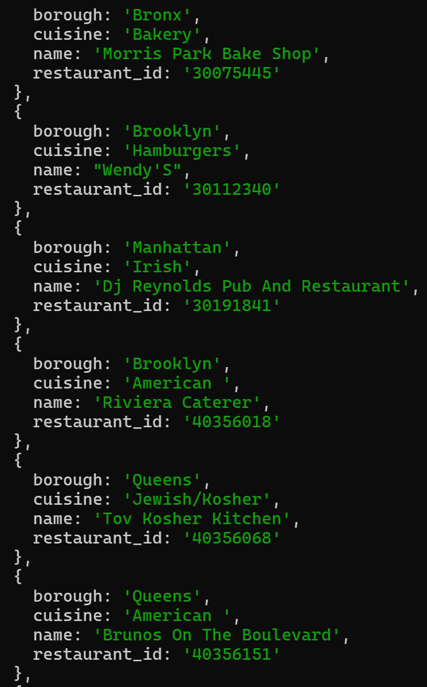 
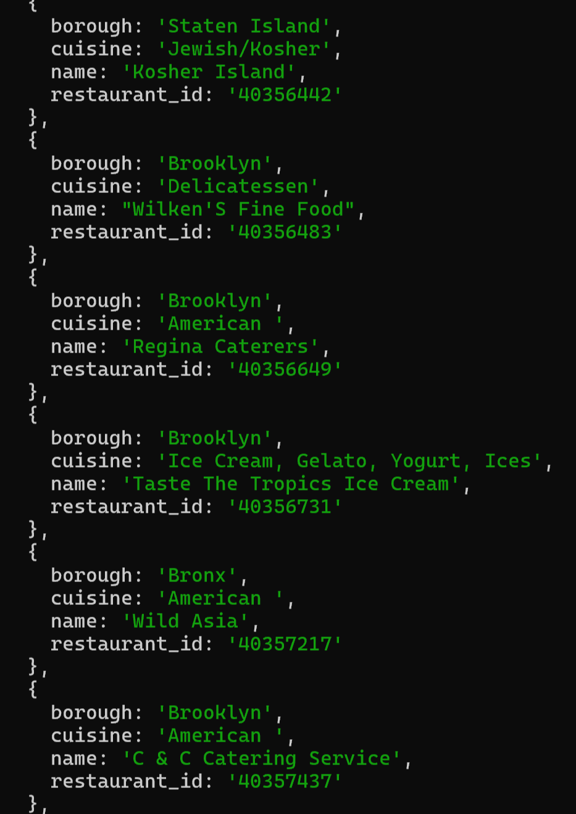 
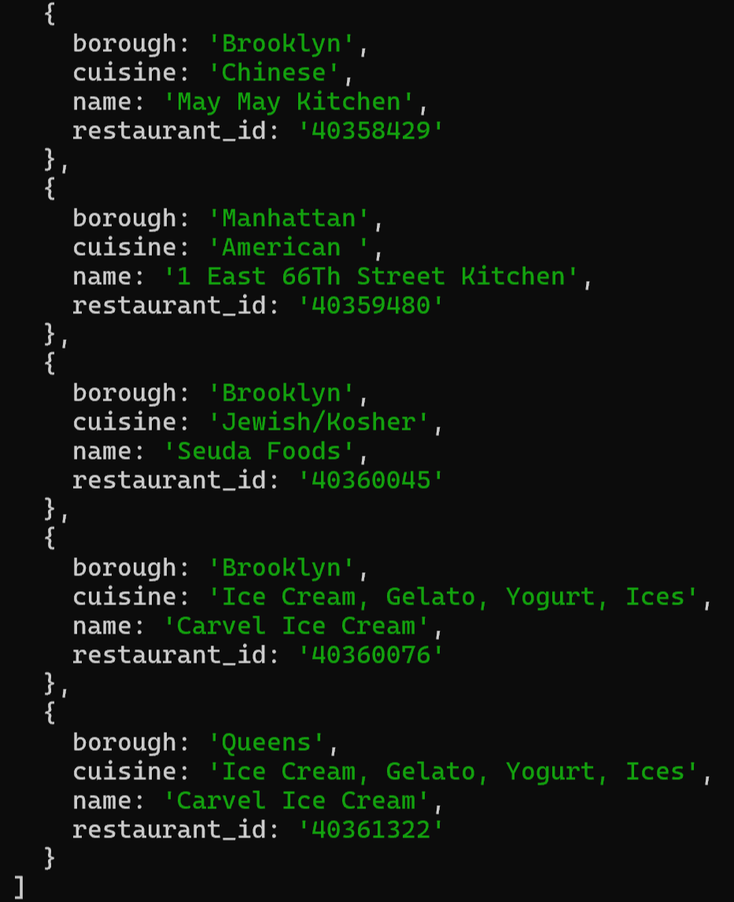 

   <li>Выведите первые 5 ресторанов в алфавитном порядке, которые находятся в районе Bronx.</li>
<pre><code>
db.restaurants.find(
  { borough: "Bronx" },
  { _id: 0, name: 1, borough: 1, cuisine: 1, restaurant_id: 1 }
).sort({ name: 1 }).limit(5)
</code></pre>
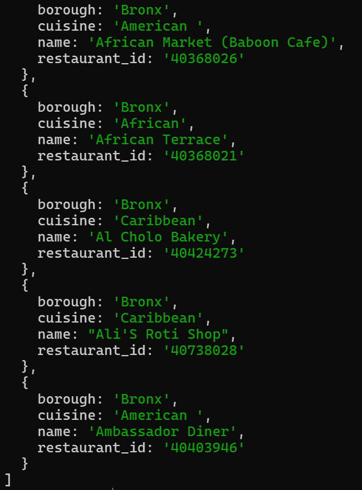 <br>
    <li>Найдите рестораны, которые набрали более 80, но менее 100 баллов.</li>
<pre><code>
db.restaurants.find(
  { 
    grades: { $elemMatch: { score: { $gt: 80, $lt: 100 } } } 
  },
  { 
    _id: 0, 
    name: 1, 
    borough: 1, 
    cuisine: 1, 
    restaurant_id: 1, 
    grades: 1 
  }
)
</code></pre>
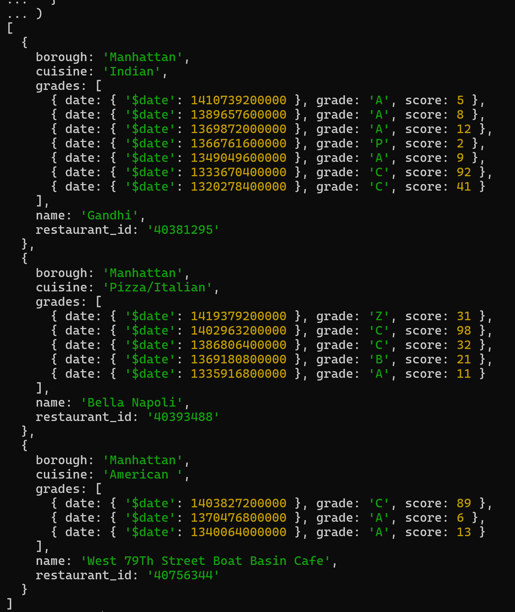 <br>
    <li>Найдите рестораны, которые не относятся к типу кухни American, получили оценку «А», не расположены в районе Brooklyn. Документ должен отображаться в соответствии с кухней в порядке убывания. (на скриншотах не всё, список очень большой )</li>
<pre><code>
db.restaurants.find(
  {
    cuisine: { $ne: "American" },
    borough: { $ne: "Brooklyn" },
    grades: { $elemMatch: { grade: "A" } }
  },
  { _id: 0, name: 1, borough: 1, cuisine: 1, restaurant_id: 1, grades: 1 }
).sort({ cuisine: -1 })
</code></pre>
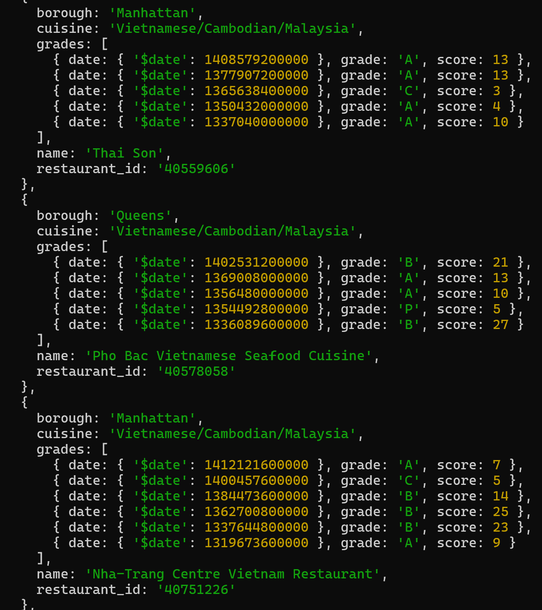
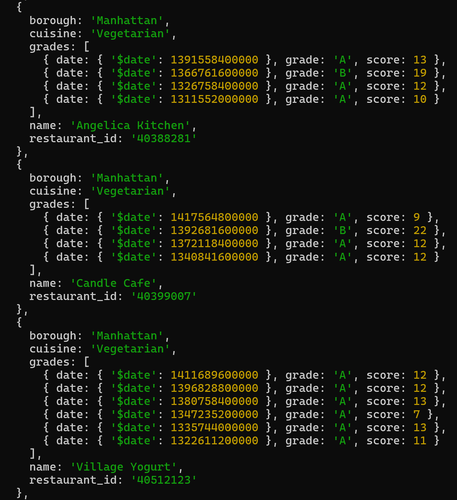
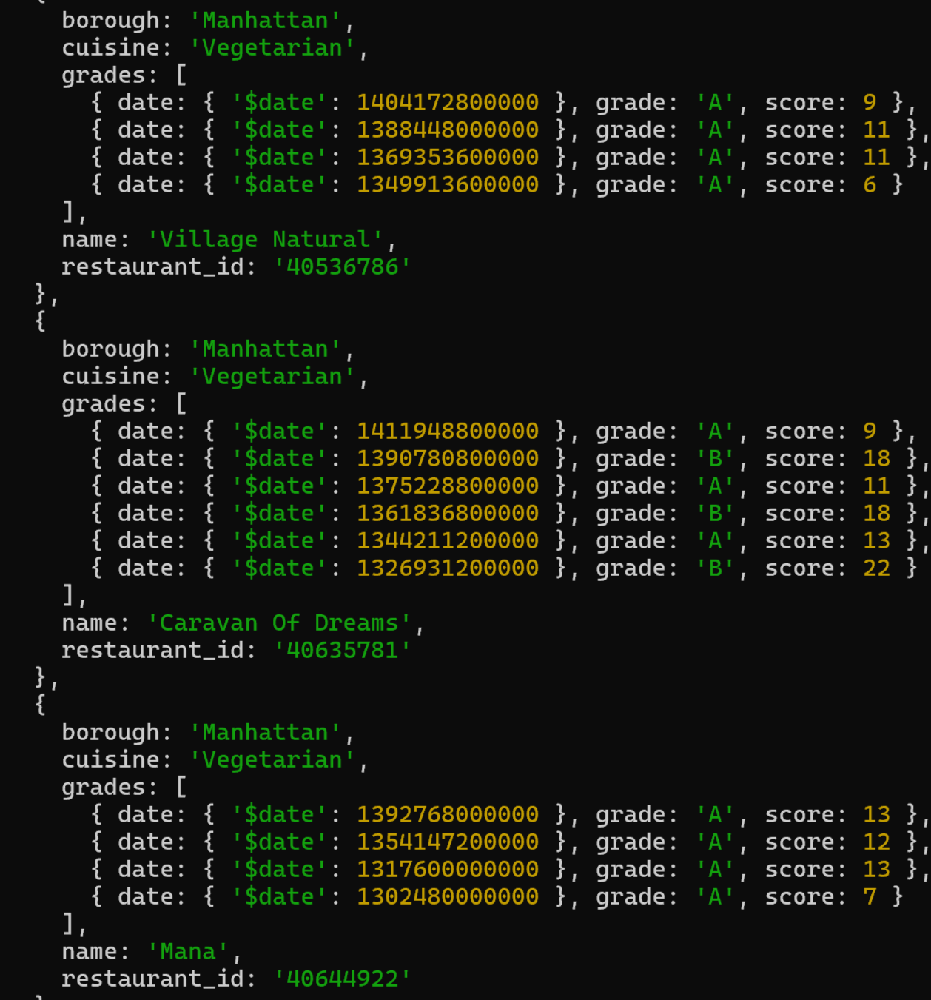
    <li>Найдите идентификатор ресторана, название, район и кухню для тех ресторанов, чье название начинается с первых трех букв назвали «Wil»</li>
<pre><code>
db.restaurants.find(
  { name: { $regex: /^Wil/ } },
  { _id: 0, restaurant_id: 1, name: 1, borough: 1, cuisine: 1 }
)
</code></pre>
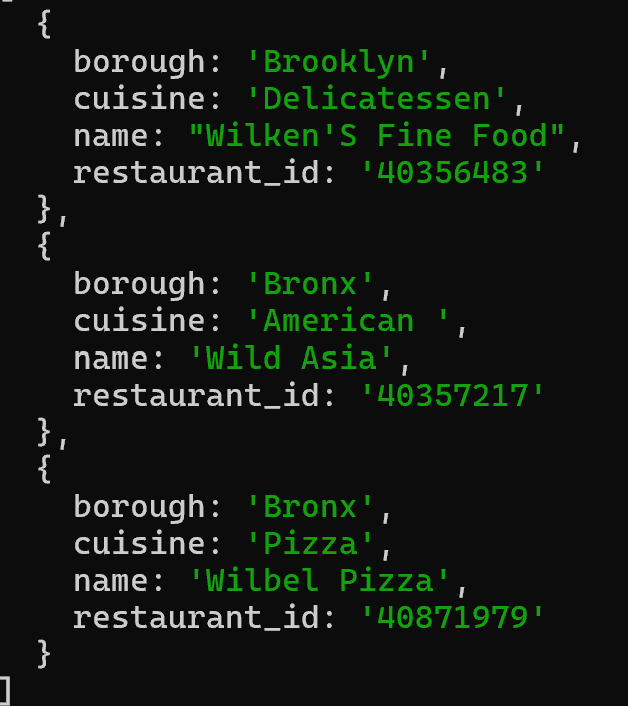 <br>
    <li>Найдите рестораны, которые относятся к району Bronx и готовят American или Chinese блюда.</li>
<pre><code>
db.restaurants.find(
  {
    borough: "Bronx",
    $or: [
      { cuisine: "American" },
      { cuisine: "Chinese" }
    ]
  },
  { _id: 0, name: 1, borough: 1, cuisine: 1, restaurant_id: 1 }
)
</code></pre>
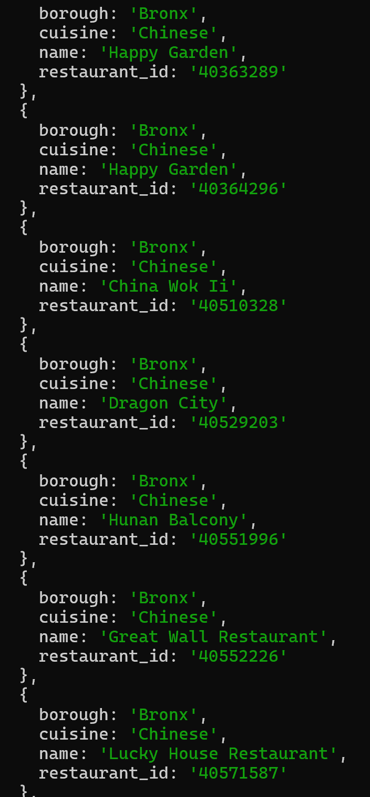
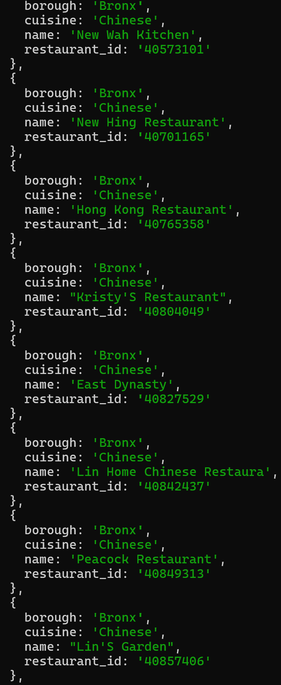
    <li>Найдите идентификатор ресторана, название и оценки для тех ресторанов, которые «2014-08-11T00: 00: 00Z» набрали 9 баллов за оценку А</li>
<pre><code>
db.restaurants.find(
  {
    grades: {
      $elemMatch: {
        "date.$date": 1407715200000,
        grade: "A",
        score: 9
      }
    }
  },
  {
    _id: 0,
    restaurant_id: 1,
    name: 1,
    grades: 1
  }
)
</code></pre>
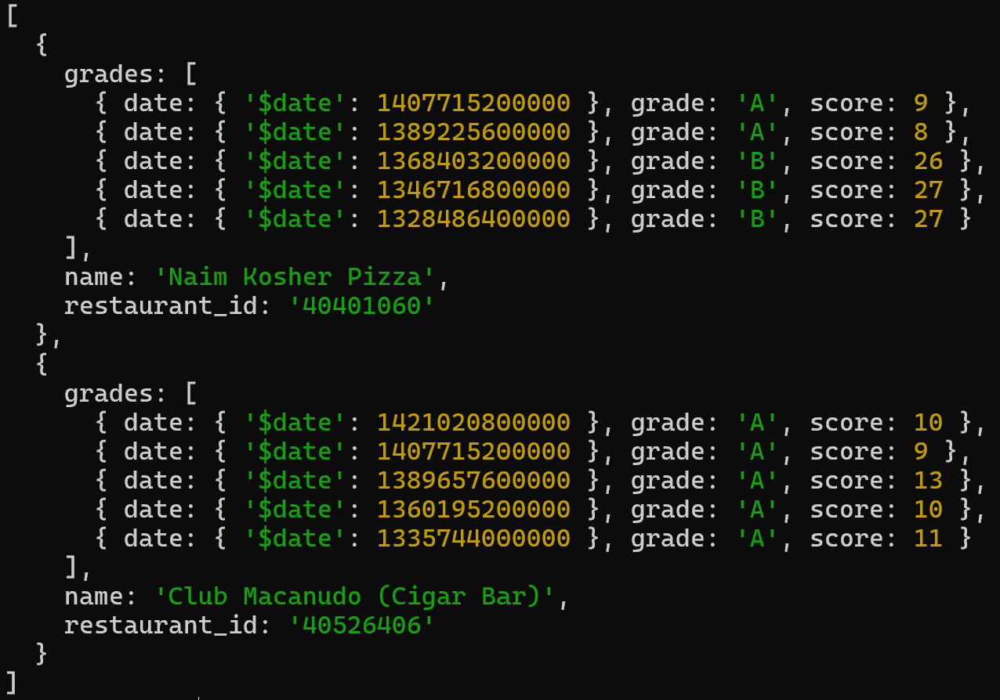 <br>
    <li>В каждом районе посчитайте количество ресторанов по каждому виду кухни. Документ должен иметь формат borough, cuisine, count</li>
<pre><code>
db.restaurants.aggregate([
  {
    $group: {
      _id: { borough: "$borough", cuisine: "$cuisine" },
      count: { $sum: 1 }
    }
  },
  {
    $project: {
      _id: 0,
      borough: "$_id.borough",
      cuisine: "$_id.cuisine",
      count: 1
    }
  }
])
</code></pre>
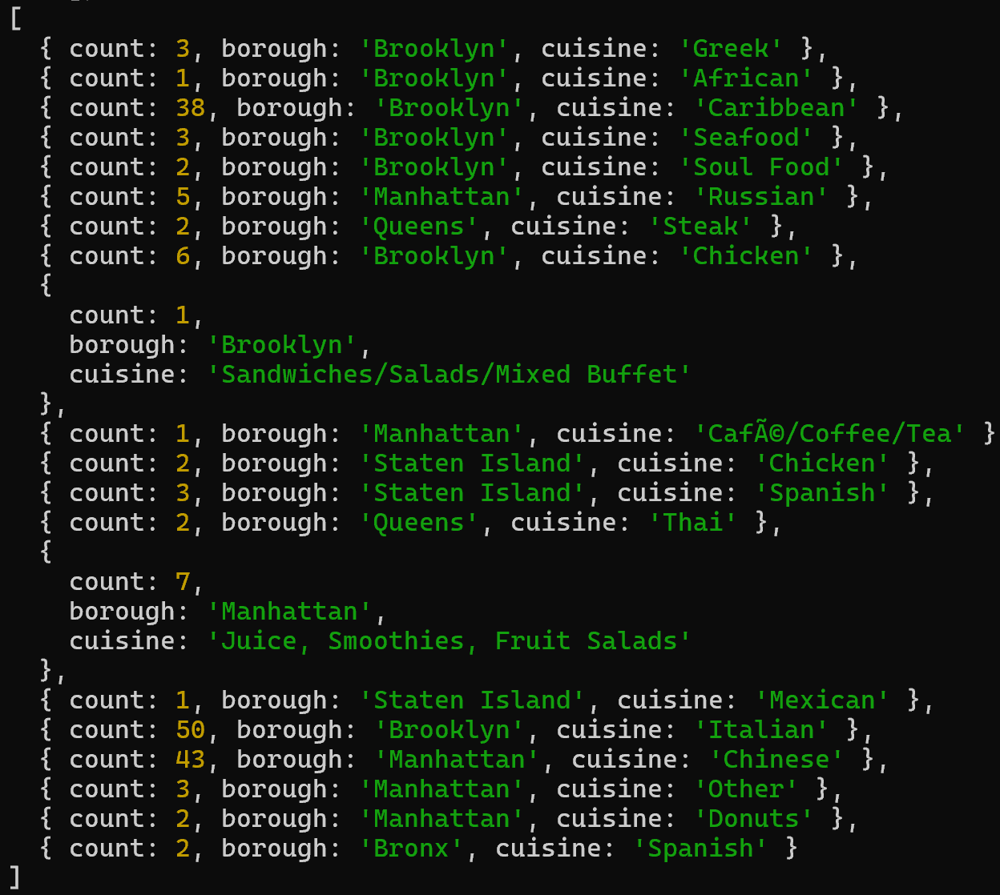 <br>
    <li>В районе Bronx найдите ресторан с минимальной суммой набранных баллов.</li>
<pre><code>
db.restaurants.aggregate([
  { $match: { borough: "Bronx" } },
  { $addFields: { totalScore: { $sum: "$grades.score" } } },
  { $sort: { totalScore: 1 } },
  { $limit: 1 },
  { $project: { _id: 0, name: 1, borough: 1, totalScore: 1, cuisine: 1 } }
])
</code></pre>
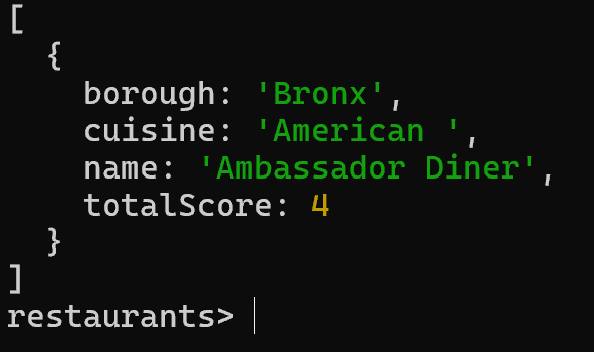 <br>
    <li>Добавьте в коллекцию свой любимый ресторан.</li>
<pre><code>
db.restaurants.insertOne({
  address: {
    building: "11",
    street: "Первомайский бульвар",
    zipcode: 150000
  },
  borough: "Ярославль",
  cuisine: "Грузинская кухня",
  grades: [
    { 
      date: "2025-12-23T16:55:00Z", 
      grade: "A", 
      score: 5 
    }
  ],
  name: "Мамука",
  restaurant_id: "666228777"
});
</code></pre>
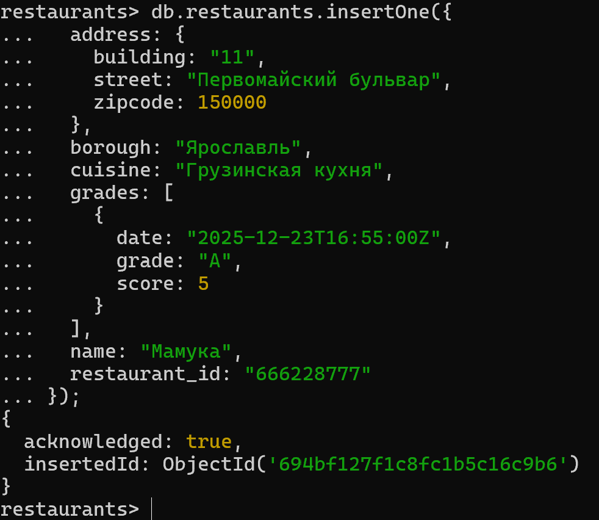 <br>
    <li>В добавленном ресторане укажите информацию о времени его работы.</li>
<pre><code>
db.restaurants.updateOne(
  {
    restaurant_id: "666228777"
  },
  {
    $set: {
      "opening_hours": {
        "monday": "12:00-23:00",
        "tuesday": "12:00-23:00",
        "wednesday": "12:00-23:00",
        "thursday": "12:00-23:00",
        "friday": "12:00-00:00",
        "saturday": "12:00-00:00",
        "sunday": "12:00-22:00"
      }
    }
  }
)
</code></pre>
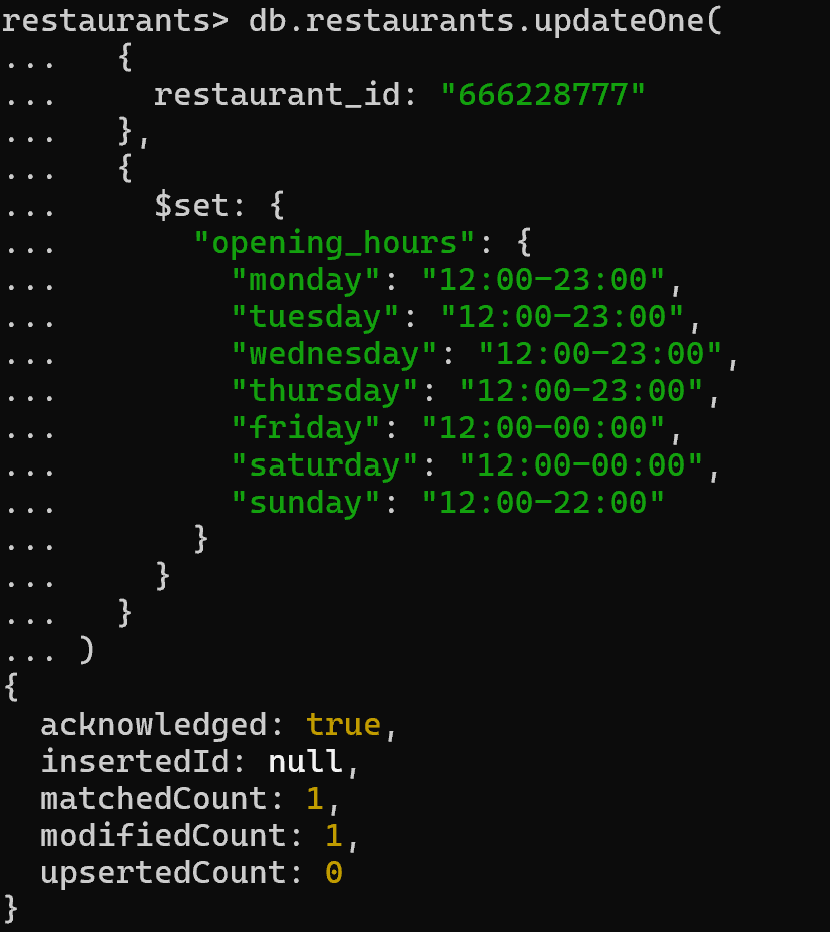 <br>
    <li>Измените время работы вашего любимого ресторана.</li>
<pre><code>
db.restaurants.updateOne(
  { restaurant_id: "666228777" },
  {
    $set: {
      "opening_hours.monday": "12:00-00:00",
      "opening_hours.tuesday": "12:00-00:00",
      "opening_hours.wednesday": "12:00-00:00",
      "opening_hours.thursday": "12:00-00:00",
      "opening_hours.friday": "12:00-00:00",
      "opening_hours.saturday": "12:00-00:00",
      "opening_hours.sunday": "12:00-00:00"
    }
  }
)
</code></pre>
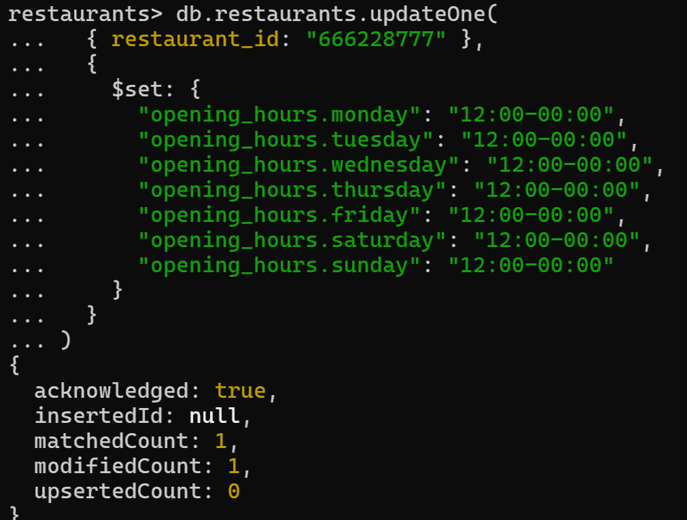 <br>
  </ol>

  <h4>Задание 2</h4>

  <p>Выполните запросы с использованием Aggregate:</p>
  <ol>
    <li>Какова разница между максимальной и минимальной температурой в течение года?</li>
<pre><code>
db.forecasts.aggregate([
  {
    $group: {
      _id: { year: "$year", month: "$month", day: "$day" },
      avgTemp: { $avg: "$temperature" }
    }
  },
  {
    $sort: { avgTemp: 1 }
  },
  {
    $skip: 10
  },
  {
    $sort: { avgTemp: -1 }
  },
  {
    $skip: 10
  },
  {
    $group: {
      _id: null,
      avgTemperature: { $avg: "$avgTemp" }
    }
  },
  {
    $project: {
      _id: 0,
      avgTemperature: 1
    }
  }
])
</code></pre>
 <br>
    <li>Найти первые 10 записей с самой низкой погодой, когда дул ветер с юга и посчитайте среднюю температуры для этих записей</li>
<pre><code>
db.forecasts.aggregate([
  {
    $match: { wind_direction: "Южный" }
  },
  {
    $sort: { temperature: 1 }
  },
  {
    $limit: 10
  },
  {
    $group: {
      _id: null,
      avgTemperature: { $avg: "$temperature" },
      records: { $push: "$$ROOT" }
    }
  },
  {
    $project: {
      _id: 0,
      avgTemperature: 1,
      records: 1
    }
  }
])
</code></pre>
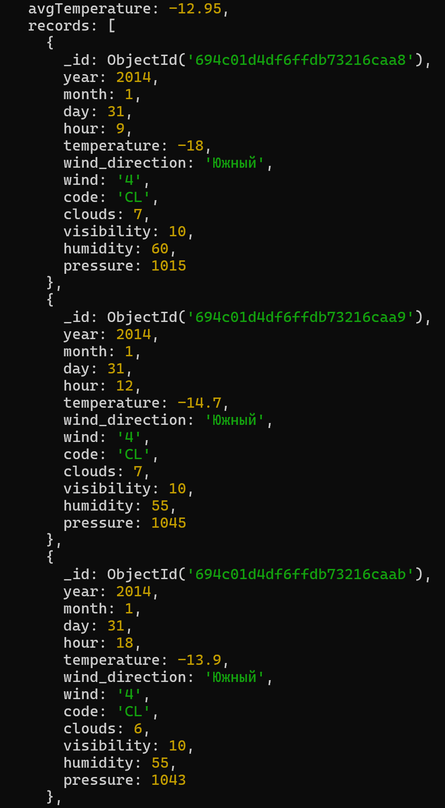
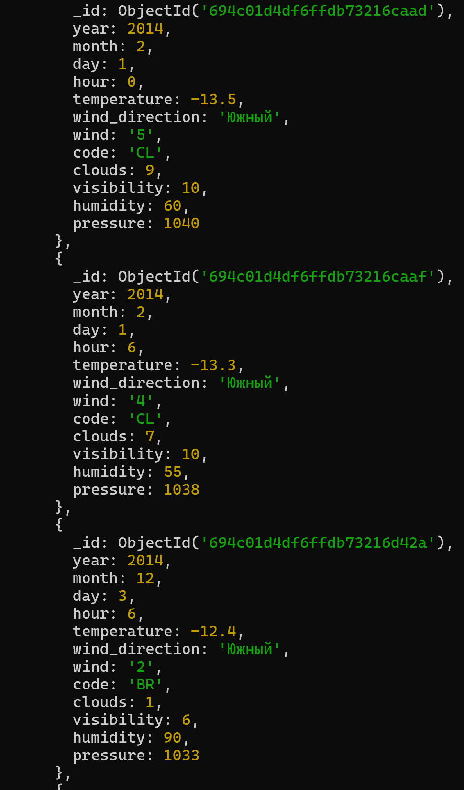
 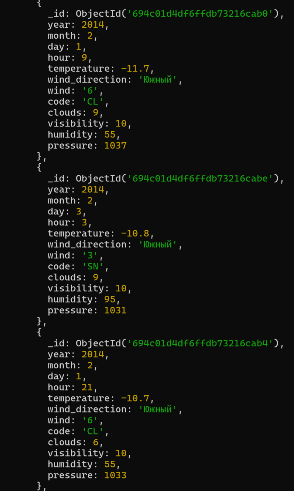
    <li>Подсчитайте количество дней, когда шел снег. (Будем считать снегом осадки, которые выпали, когда температура была ниже нуля)</li>
<pre><code>
db.forecasts.aggregate([
  {
    $match: { temperature: { $lt: 0 } }
  },
  {
    $group: {
      _id: { year: "$year", month: "$month", day: "$day" }
    }
  },
  {
    $count: "snowyDays"
  }
])
</code></pre>
 <br>
    <li>В течение зимы иногда шел снег, а иногда дождь. Насколько больше (или меньше) выпало осадков в виде снега.</li>
<pre><code>
db.forecasts.aggregate([
  {
    $match: {
      month: { $in: [12, 1, 2] },
      code: { $in: ["SN", "RA"] }
    }
  },
  {
    $group: {
      _id: null,
      snowDays: {
        $sum: { $cond: [{ $eq: ["$code", "SN"] }, 1, 0] }
      },
      rainDays: {
        $sum: { $cond: [{ $eq: ["$code", "RA"] }, 1, 0] }
      }
    }
  },
  {
    $project: {
      _id: 0,
      snowDays: 1,
      rainDays: 1,
      difference: { $subtract: ["$snowDays", "$rainDays"] }
    }
  }
])
</code></pre>
 <br>
    <li>Какова вероятность того что в ясный день выпадут осадки? (Предположим, что день считается ясным, если ясная погода фиксируется более чем в 75% случаев)</li>
<pre><code>
db.forecasts.aggregate([
  {
    $group: {
      _id: { year: "$year", month: "$month", day: "$day" },
      total: { $sum: 1 },
      clear_count: { $sum: { $cond: [{ $eq: ["$code", "CL"] }, 1, 0] } },
      precipitation_count: { $sum: { $cond: [{ $ne: ["$code", "CL"] }, 1, 0] } }
    }
  },
  {
    $project: {
      _id: 1,
      total: 1,
      clear_count: 1,
      precipitation_count: 1,
      clear_ratio: { $divide: ["$clear_count", "$total"] },
      has_precipitation: { $gt: ["$precipitation_count", 0] }
    }
  },
  {
    $match: {
      clear_ratio: { $gt: 0.75 }
    }
  },
  {
    $group: {
      _id: null,
      clear_days: { $sum: 1 },
      clear_days_with_precipitation: { $sum: { $cond: ["$has_precipitation", 1, 0] } }
    }
  },
  {
    $project: {
      _id: 0,
      probability: { $divide: ["$clear_days_with_precipitation", "$clear_days"] }
    }
  }
])
</code></pre>
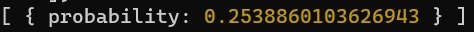 <br>
    <li>Увеличьте температуру на один градус при каждом измерении в нечетный день во время зимы. На сколько градусов изменилась средняя температура?</li>
<pre><code>
var avg_before = db.forecasts.aggregate([
  { $match: { month: { $in: [12, 1, 2] } } }, 
  { $group: { _id: null, avgTemp: { $avg: "$temperature" } } }
]).toArray()[0].avgTemp;

db.weather.updateMany(
  {
    month: { $in: [12, 1, 2] },
    day: { $mod: [2, 1] } 
  },
  { $inc: { temperature: 1 } }
);

var avg_after = db.forecasts.aggregate([
  { $match: { month: { $in: [12, 1, 2] } } },
  { $group: { _id: null, avgTemp: { $avg: "$temperature" } } }
]).toArray()[0].avgTemp;

print("Средняя температура до обновления:", avg_before);
print("Средняя температура после обновления:", avg_after);
print("Изменение средней температуры:", avg_after - avg_before);
</code></pre>
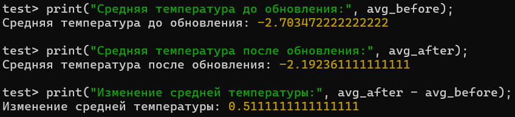 <br>
  </ol>
</div>


